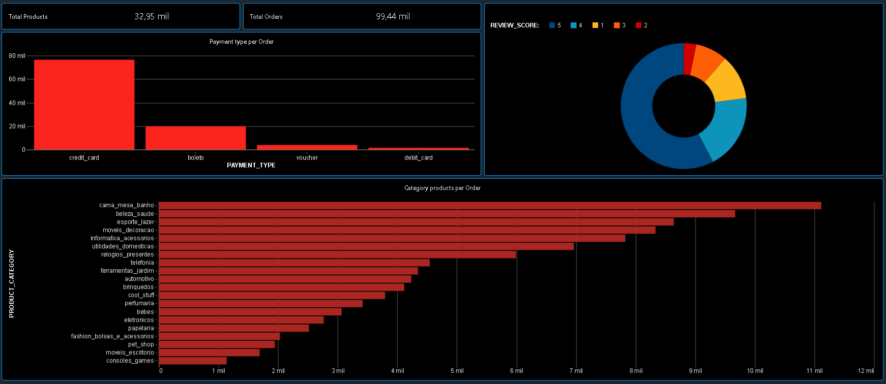
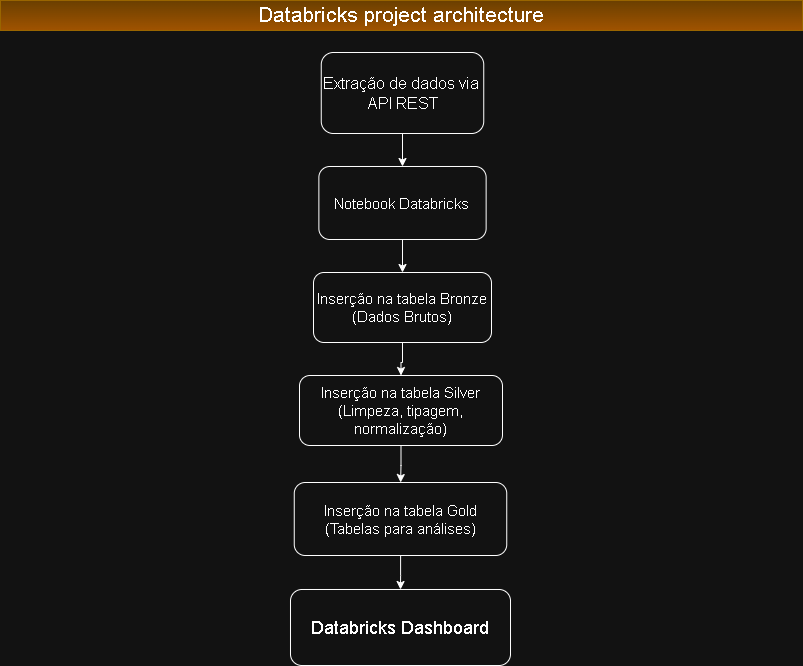
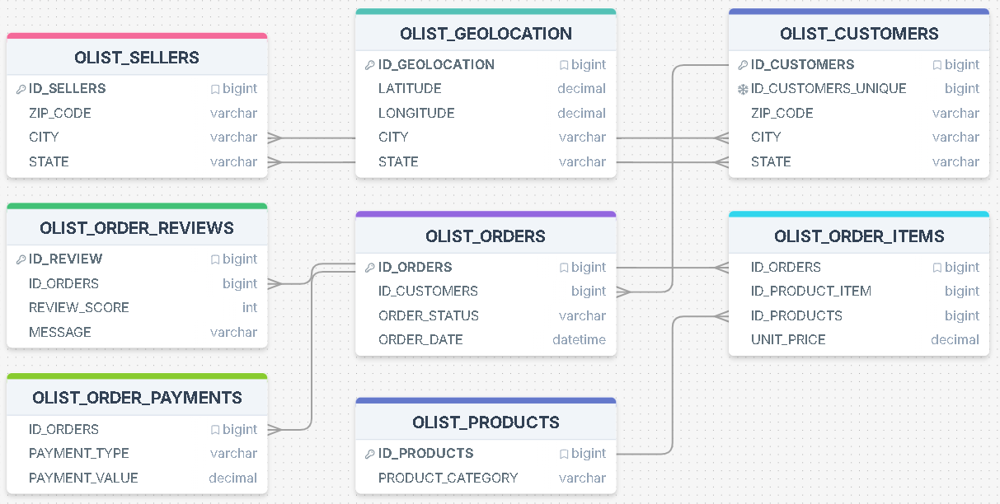

# 🚀 Projeto Olist Databricks — Arquitetura Lakehouse

Este repositório apresenta um projeto construido em arquitetura **Lakehouse** utilizando Microsoft Azure e Azure Databricks, estruturado em camadas **Bronze**, **Silver** e **Gold**.

## 🔍 Visão Geral do Projeto

O objetivo deste projeto é demonstrar um pipeline de dados end-to-end, desde a ingestão de dados brutos até a criação de outputs analíticos, utilizando:

- Azure Databricks
- PySpark / Spark SQL
- Delta Lake
- Unity Catalog
- dbutils.secrets para gerenciamento seguro de credenciais
- Armazenamento em containers no Azure Data Lake Storage (ADLS Gen2)

O projeto contempla também um **job pipeline** criado no Databricks para orquestrar automaticamente a sequência de notebooks sem necessidade de geração manual de arquivos intermediários.

## 🧱 Arquitetura – Medallion (Bronze, Silver e Gold)

### 🥉 Bronze

A camada Bronze é responsável pela ingestão de dados brutos da fonte original (arquivos CSV da Olist), preservando o formato original dos dados e gravando-os em formato Delta. Essa etapa garante rastreabilidade e permite reprocessamentos.

### 🥈 Silver

Na camada Silver, aplicam-se transformações de limpeza, padronização, normalização de tipos e outras regras de qualidade de dados, elevando a consistência dos dados e preparando-os para análises mais confiáveis.

### 🥇 Gold

A camada Gold agrega, resume e modela os dados prontos para consumo analítico. 

---

# ☁️ Infraestrutura

## 🔹 Ambiente Cloud

- Microsoft Azure  
- Azure Databricks Workspace  
- Cluster configurado com encerramento automático  
- Container para persistência das tabelas Delta  

## 🔹 Motor de Processamento

- Apache Spark (PySpark / SQL)  
- Delta Lake como camada de armazenamento  

---

### 🎯 Objetivo Técnico

Disponibilizar tabelas otimizadas para consumo analítico e dashboards.

---

# 📊 Relatórios

Relatório gerado a partir das tabelas finais (Silver e Gold).

---

# 🗺 Diagrama da Arquitetura

---

# 🧩 Modelagem de Dados

## 🧪 Boas Práticas e Recomendações

Este projeto segue práticas recomendadas em engenharia de dados, como:
- Isolamento de camadas de dados (Medallion)  
- Uso de Delta Lake para garantir transações ACID  
- Governança e organização com Unity Catalog  
- Gerenciamento de credenciais com dbutils.secrets  
- Uso de containers no Data Lake para persistência externa  
- Pipeline automatizado por Jobs  

Essas práticas contribuem para um pipeline organizado, auditável e escalável em ambiente cloud. 

---

